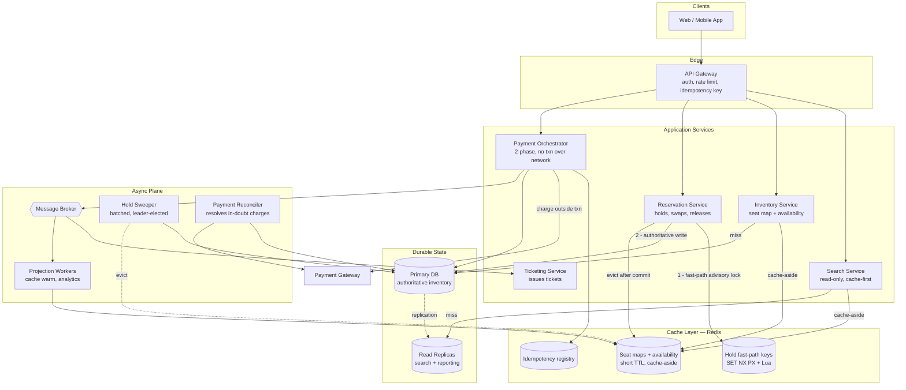
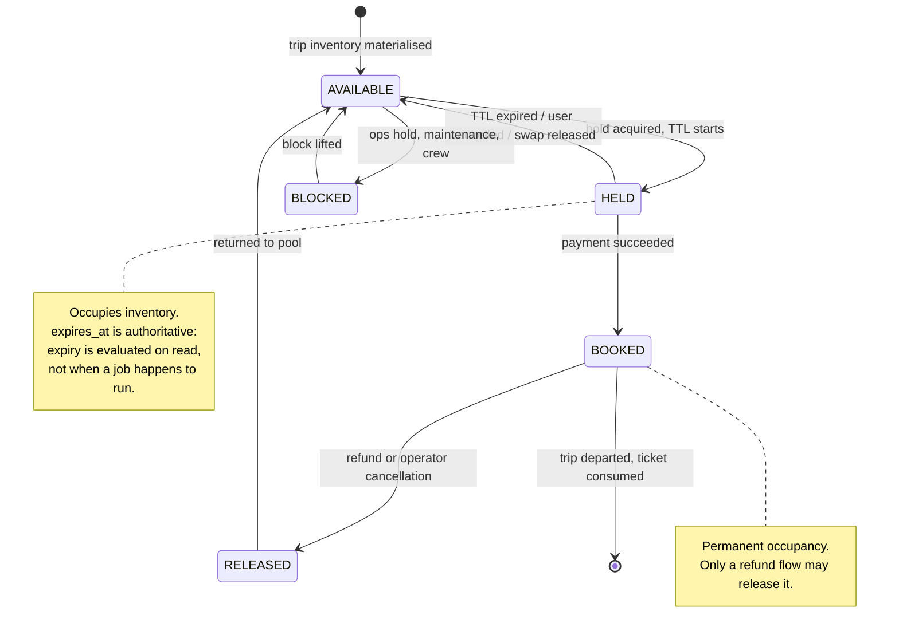
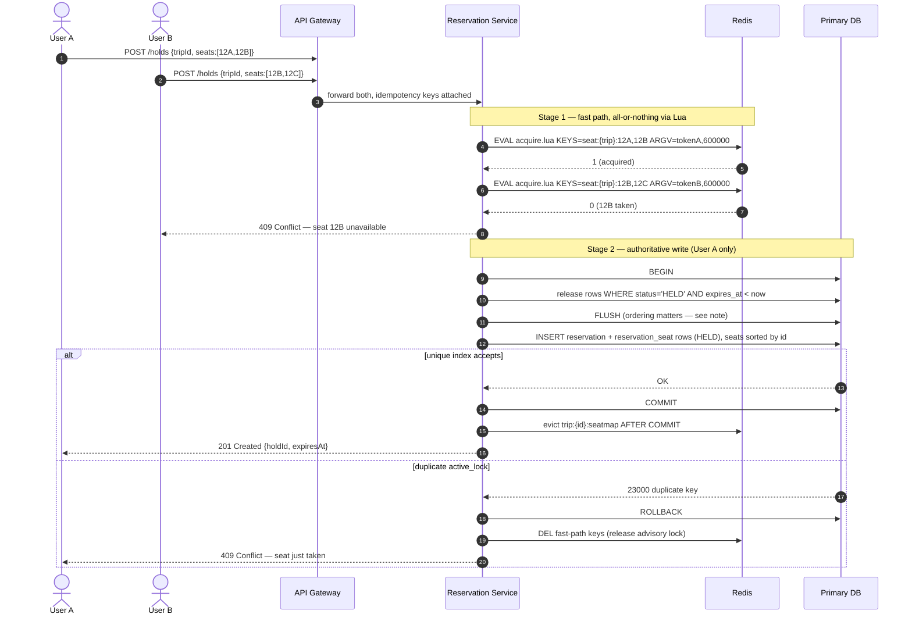
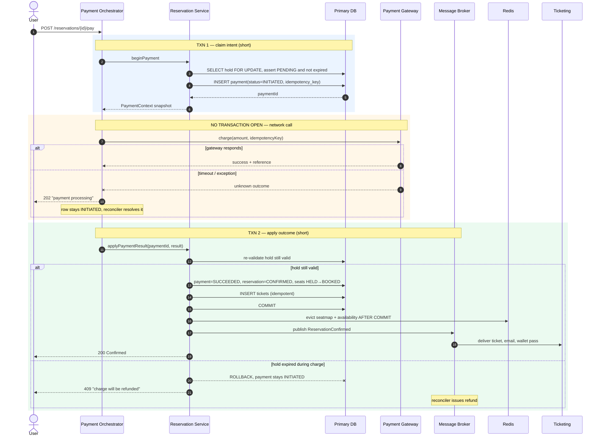
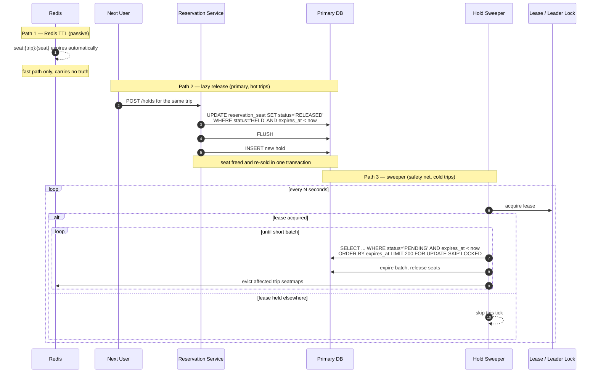

# Journey Booking & Seat Reservation — Architecture Blueprint

**Audience:** Principal / Senior Engineers
**Scope:** search → seat hold → checkout → confirmation, under high read concurrency and contended writes.

---

## 0. Design Tenets

Five rules that the rest of the document derives from.

1. **The database is the arbiter of inventory. The cache is an accelerator.**
   Redis may say a seat is free and be wrong; the database must never be wrong. Every hold is ultimately validated by a uniqueness constraint inside the same transaction that writes it.
2. **Holds are leases, not locks.** A hold has a wall-clock expiry stored in the row. Correctness must not depend on a background job running on time — expiry is *evaluated on read*, and the sweeper is only a garbage collector.
3. **Never hold a database transaction across a network call.** Payment is split into short transactions with the gateway call in the gap.
4. **Every in-doubt state must be resolvable by a reconciler.** If a process dies between "charged" and "confirmed", a job must be able to finish or reverse it.
5. **Money and inventory reconcile independently.** A charge that cannot be honoured is refunded, not silently dropped.

---

## 1. System Architecture



**Layer responsibilities**

- **API Gateway** — authn/z, per-user rate limiting, and *client-supplied idempotency keys* on all mutating calls. Seat-hold endpoints are the hottest abuse target; throttle per user *and* per trip.
- **Search Service** — pure read path. Served from cache, falling back to **read replicas**. Never touches the primary; stale-by-seconds is acceptable here.
- **Inventory Service** — owns the seat map projection. Cache-aside with a short TTL.
- **Reservation Service** — the only writer of hold state. Two-step: Redis advisory lock (fast rejection), then the authoritative DB write.
- **Payment Orchestrator** — separate service/bean so its transaction boundaries are real (see §6).
- **Sweeper / Reconciler** — background safety nets, both idempotent, both **leader-elected or lease-based** so N replicas don't stampede.

---

## 2. Domain Model (ERD)

```mermaid
erDiagram
    USER ||--o{ RESERVATION : places
    USER ||--o{ PAYMENT : pays

    ROUTE ||--o{ JOURNEY : "scheduled as"
    JOURNEY ||--o{ TRIP : "runs on date"
    TRAINSET ||--o{ COACH : "composed of"
    TRIP }o--|| TRAINSET : "operated by"
    COACH ||--o{ SEAT : contains

    TRIP ||--o{ SEAT_INVENTORY : "materialises"
    SEAT ||--o{ SEAT_INVENTORY : "instance per trip"

    RESERVATION ||--o{ RESERVATION_SEAT : holds
    SEAT_INVENTORY ||--o{ RESERVATION_SEAT : "locked by"
    RESERVATION ||--o| PAYMENT : "settled by"
    RESERVATION ||--o{ TICKET : issues

    USER {
        bigint id PK
        string external_ref UK
        string email
    }
    ROUTE {
        bigint id PK
        string origin_code
        string destination_code
    }
    JOURNEY {
        bigint id PK
        bigint route_id FK
        time departure_time
        string service_class
    }
    TRIP {
        bigint id PK
        bigint journey_id FK
        bigint trainset_id FK
        date service_date
        string status "SCHEDULED|CANCELLED|DEPARTED"
    }
    COACH {
        bigint id PK
        bigint trainset_id FK
        string code
        string class "FIRST|STANDARD"
        int capacity
    }
    SEAT {
        bigint id PK
        bigint coach_id FK
        string label
        string attributes "window|aisle|table"
    }
    SEAT_INVENTORY {
        bigint id PK
        bigint trip_id FK
        bigint seat_id FK
        decimal price
        string status
    }
    RESERVATION {
        bigint id PK
        bigint user_id FK
        bigint trip_id FK
        string status "PENDING|CONFIRMED|EXPIRED|CANCELLED"
        int quantity
        decimal total_amount
        timestamp expires_at
        bigint version
    }
    RESERVATION_SEAT {
        bigint id PK
        bigint reservation_id FK
        bigint seat_inventory_id FK
        decimal price
        string status "HELD|BOOKED|RELEASED"
        string active_lock UK "generated, NULL when released"
    }
    PAYMENT {
        bigint id PK
        bigint reservation_id FK UK
        string idempotency_key UK
        string status "INITIATED|SUCCEEDED|FAILED|REFUNDED"
        decimal amount
    }
    TICKET {
        bigint id PK
        bigint reservation_id FK
        string ticket_number UK
        string seat_label_snapshot
    }
```

**Modelling notes**

- **`SEAT` vs `SEAT_INVENTORY`.** `SEAT` is physical (coach 3, seat 12A) and static. `SEAT_INVENTORY` is *that seat on that trip*, and is what gets sold. Without this split you cannot price or sell the same physical seat differently across dates.
- **`TICKET` snapshots** the seat label and class at issue time. Physical layouts get re-mapped; an issued ticket must never change retroactively.
- **`RESERVATION.version`** gives optimistic locking on the aggregate.
- **`RESERVATION_SEAT.active_lock`** is the keystone — see §5.

---

## 3. Seat Lifecycle State Machine



**Why this shape**

- `HELD` and `BOOKED` are the only states that occupy inventory. The uniqueness constraint keys off exactly this pair.
- **Expiry is lazy-evaluated.** A `HELD` row past `expires_at` is *treated as free* on the next read of that trip, and released in the same transaction as the new hold. The sweeper only reclaims rows for trips nobody is browsing.
- **`RELEASED` is terminal for that row**, not a return to `HELD`. Releasing writes a new row on re-hold, preserving an append-only audit trail of who held what and when.
- **`BLOCKED`** exists so operations can withhold seats without inventing a fake reservation.

---

## 4. Flow A — Seat Hold & Lock Acquisition



**Race-condition resolution — two layers, one authority**

| Layer | Mechanism | Purpose | Authoritative? |
|---|---|---|---|
| Redis | `SET NX PX` inside a Lua script | Reject 99% of collisions in <1 ms, shield the DB | **No** |
| Database | `UNIQUE` on a generated column | Guarantee no double-booking, ever | **Yes** |

**Atomic multi-seat acquisition (Lua).** Seat selection is all-or-nothing — a party of three won't accept two seats. `SET NX` per key is not atomic across keys, so it must be scripted:

```lua
-- KEYS[1..N] = seat:{tripId}:{seatId}
-- ARGV[1]    = hold token (uuid)
-- ARGV[2]    = ttl millis
for i = 1, #KEYS do
  if redis.call('EXISTS', KEYS[i]) == 1 then
    return 0                      -- someone else holds one: take nothing
  end
end
for i = 1, #KEYS do
  redis.call('SET', KEYS[i], ARGV[1], 'PX', tonumber(ARGV[2]))
end
return 1
```

Redis executes scripts single-threaded, so the check-and-set window is closed.

**Two non-obvious correctness details**

1. **Flush ordering.** Releasing expired holds is an `UPDATE`; taking the new hold is an `INSERT`. ORMs commonly order INSERTs *before* UPDATEs within a flush — so the insert collides with the row you were about to free. Force a flush between the two.
2. **Deterministic seat ordering.** Sort seat IDs before inserting. Two overlapping requests acquiring `{A,B}` and `{B,A}` take index locks in opposite order and deadlock. A global order turns a deadlock into a clean wait-then-conflict.

---

## 5. The Uniqueness Guard (the load-bearing detail)

Partial indexes (`WHERE status IN (...)`) don't exist in MySQL. A **generated column** plus its NULL semantics reproduces them:

```sql
active_lock VARCHAR(48) GENERATED ALWAYS AS (
    CASE WHEN status IN ('HELD','BOOKED')
         THEN CONCAT(trip_id, '-', seat_inventory_id)
         ELSE NULL END
) STORED,
CONSTRAINT uq_reservation_seat_active UNIQUE (active_lock)
```

- Occupied rows produce a non-null key → any second occupant violates the constraint.
- Released rows produce `NULL`, and SQL permits **unlimited NULLs** in a unique index → seats recycle freely.
- Correctness holds even if the application is bypassed entirely (admin scripts, migrations, a second service).

> **Operational warning, learned the hard way.** An ORM configured with schema auto-generation (`ddl-auto: update`/`create`) will recreate this table from the entity classes — and it cannot see a generated column, because it isn't a mapped field. The column and its unique index vanish silently. Every code path still *looks* correct; the conflict handler simply becomes dead code and double-booking becomes possible. Pin schema management to migrations only (`validate`), and add a test that asserts the constraint exists.

---

## 6. Flow B — Payment Completion & Persistence



**Why three steps and two transactions**

- A gateway call can take seconds. Holding a transaction across it pins connections and escalates lock contention until the pool starves.
- The `INITIATED` row is the **durable record of intent**. If the process dies at any point after it, the reconciler can query the gateway by idempotency key and finish the job.
- The rollback in the "hold expired" branch is *deliberate*: it preserves `INITIATED` so the reconciler refunds. Making this path "not throw" would strand real charges.
- Ticket generation must be **idempotent** (no-op if tickets exist), because reconciliation can confirm the same reservation a second time.

**Cache write strategy at confirmation:** evict, don't write-through. Registered as an **after-commit callback**, never inline — otherwise a concurrent reader repopulates the cache from pre-commit state and the stale entry outlives the transaction.

---

## 7. Flow C — Expiration & Cleanup



**Three release paths, deliberately redundant**

| Path | Trigger | Role |
|---|---|---|
| Redis TTL | key expiry | Frees the *advisory* lock only |
| Lazy release | next hold on that trip | **Primary** — hot inventory recycles instantly |
| Sweeper | scheduled | Safety net for trips nobody is browsing |

**Sweeper design requirements**

- **Bounded batches** (~200) — a flash-sale expiry wave otherwise pulls tens of thousands of rows into one transaction and holds locks across the lot.
- **`FOR UPDATE SKIP LOCKED`** — lets concurrent workers make progress instead of queueing.
- **Leader election or a lease** — otherwise every replica runs the same sweep simultaneously.
- **Cap iterations per tick** so one run can never become unbounded.

The correctness invariant: *the sweeper going down must degrade performance, never correctness.* Lazy release guarantees that.

---

## 8. Caching & Concurrency Blueprint

### 8.1 Key space

| Key | Type | TTL | Pattern | Contents |
|---|---|---|---|---|
| `trip:{tripId}:seatmap` | String (JSON) or Hash | 2–5 s | Cache-aside | Full seat map with per-seat status |
| `trip:{tripId}:availability` | Hash | 2–5 s | Cache-aside | `{class → free_count}` counters |
| `search:{origin}:{dest}:{date}` | Sorted Set | 30–60 s | Cache-aside | Trip IDs scored by departure |
| `journey:{journeyId}:meta` | Hash | 1 h | Write-through | Static route/schedule data |
| `seat:{tripId}:{seatId}` | String | = hold TTL | Write-only lock | Hold token — fast-path advisory lock |
| `hold:{holdId}` | Hash | = hold TTL | Write-through | Hold metadata for quick lookup |
| `user:{userId}:holds` | Set | = hold TTL | Write-through | Enforces "max N concurrent holds" |
| `idem:{key}` | String | 24 h | Write-through | Response snapshot for retried requests |

**Why the seat map TTL is *seconds*, not minutes.** A stale seat map can never cause a double-booking — the DB constraint stops that. It only causes a user to click a seat that's gone and receive a 409. Seconds keeps that rare without hammering the primary.

### 8.2 Pattern selection

| Data | Pattern | Rationale |
|---|---|---|
| Seat maps, availability | **Cache-aside + evict-after-commit** | High churn; write-through would serialise writers behind cache latency and risks caching uncommitted state |
| Trip/journey metadata | **Write-through** | Near-static, read constantly; staleness is the real risk, not contention |
| Search results | **Cache-aside**, longer TTL | Tolerates staleness; protects replicas from fan-out |
| Hold locks | **Write-only in Redis** | Not a cache — an advisory lock with a lease |

### 8.3 Concurrency strategy by contention shape

| Shape | Strategy | Where |
|---|---|---|
| Two users, same seat | **DB unique constraint** on generated column | Authoritative |
| Same-seat storm (flash sale) | **Redis Lua** fast rejection | Shields the DB |
| Quota/unreserved-class counters | **Pessimistic row lock** at the *narrowest* scope | See below |
| Concurrent edits to one reservation | **Optimistic `@Version`** | Lost-update protection |
| Duplicate submits / retries | **Idempotency key** at gateway + unique index | End-to-end |

**Lock at the narrowest correct scope.** If unreserved-seating capacity is per coach class, lock the *class quota row*, not the trip. Locking the trip serialises every sale on that trip — including classes that don't contend at all. This is the single most common throughput mistake in this design.

### 8.4 Failure modes

| Failure | Behaviour | Mitigation |
|---|---|---|
| **Cache miss** | Falls through to DB, repopulates | Ensure the loader is indexed; miss cost grows with hall/train size — paginate by coach |
| **Redis down** | Fast path unavailable; DB constraint still correct | Degrade to DB-only; **circuit-break to avoid a stampede** and shed load rather than melt the primary |
| **Thundering herd on expiry** | Many keys expire together | **Jitter the TTL** (`base ± 20%`); optional single-flight/lock-on-miss |
| **Network partition (app ↔ Redis)** | Advisory lock lost, DB unaffected | Never treat Redis as authority; short timeouts (≈500 ms) with fallback |
| **Abandoned checkout** | Hold expires | Lazy release + sweeper (§7) |
| **Crash mid-payment** | Payment stuck `INITIATED` | Reconciler confirms or refunds by idempotency key |
| **Gateway timeout** | Outcome unknown | Same as above; user told "processing", never double-charged (idempotency key) |
| **Duplicate pay requests** | One wins on unique `reservation_id` | Return **409**, not 500 |
| **Clock skew across replicas** | Premature/late expiry | Evaluate expiry with **DB time**, not app time |
| **Replica lag on search** | Slightly stale trip list | Acceptable; holds/checkout always read the primary |

---

## 9. Capacity & Complexity

| Operation | Complexity | Notes |
|---|---|---|
| Hold N seats | `O(N + E)` | E = expired holds released inline; ~4 queries |
| Quota booking | `O(1)` + 2 aggregates | Serialised by the narrow row lock |
| Seat map (miss) | `O(S + A)` | S = seats on trip, A = active holds |
| Seat map (hit) | `O(1)` | Redis GET |
| Sweeper tick | `O(B)`, B = batch | Bounded by construction |

**Required indexes** — each matching a full predicate:

```sql
CREATE UNIQUE INDEX uq_reservation_seat_active ON reservation_seat (active_lock);
CREATE INDEX idx_rs_trip_status              ON reservation_seat (trip_id, status);
CREATE INDEX idx_res_trip_status_expiry      ON reservation (trip_id, status, expires_at);
CREATE INDEX idx_res_quota_status_expiry     ON reservation (quota_id, status, expires_at);
CREATE INDEX idx_res_user_created            ON reservation (user_id, created_at DESC, id DESC);
CREATE INDEX idx_payment_status_updated      ON payment (status, updated_at);
```

---

## 10. Review Checklist

Before this design ships, verify:

- [ ] `uq_*_active` unique index **exists in the deployed database** — assert it in an automated test, not by inspection
- [ ] Schema tooling is `validate`/migrations-only; auto-DDL disabled in every environment
- [ ] Seat IDs sorted before insert (deadlock avoidance)
- [ ] Flush forced between expiry-release and new-hold insert
- [ ] Payment split across two transactions, gateway call in the gap
- [ ] Ticket generation idempotent
- [ ] Cache eviction registered **after commit**
- [ ] Sweeper batched, `SKIP LOCKED`, leader-elected
- [ ] Cache TTLs jittered
- [ ] Duplicate-pay returns 409, not 500
- [ ] A refund path exists that returns `BOOKED` seats to the pool and clears any `SOLD_OUT` flag
